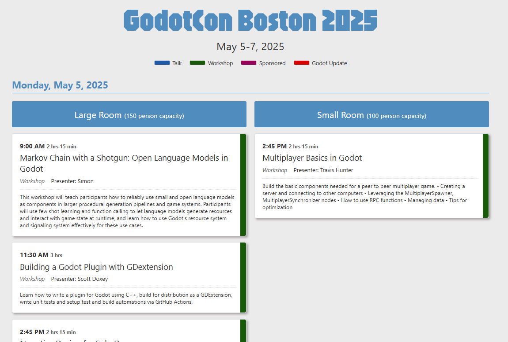

# Godotcon Schedule Printout
This is a way for people to have a more custom generated printout of the speaking schedule for a Godotcon. With a nice printout, it is easier for people to see the upcoming speakers instead of always needing to look at their phone. This was originally made for the Boston Godotcon in 2025.

## Installation and running
This is a simple web app that just reads JSON file in and generates the schedule. You will need NPM at the least. This is only because that is needed to load JSON data. Clone this repository to a directory. Open a command line and run a couple commands

    npm install
    npm run dev

A web browser window should come up and you should see a schedule like the screenshot shows

## Customizing the schedule
The main driver of the data is the schedule-data.json file at the root of this repository. The original JSON data was retrieved from the talks.godotengine.org website. There is a </> button on the top right where you can export out the schedule. I clicked the JSON button, then copied the results to the schedule-data.json file. The Boston Godotcon schedule page looked like this: https://talks.godotengine.org/godotcon-us-2025/schedule/

